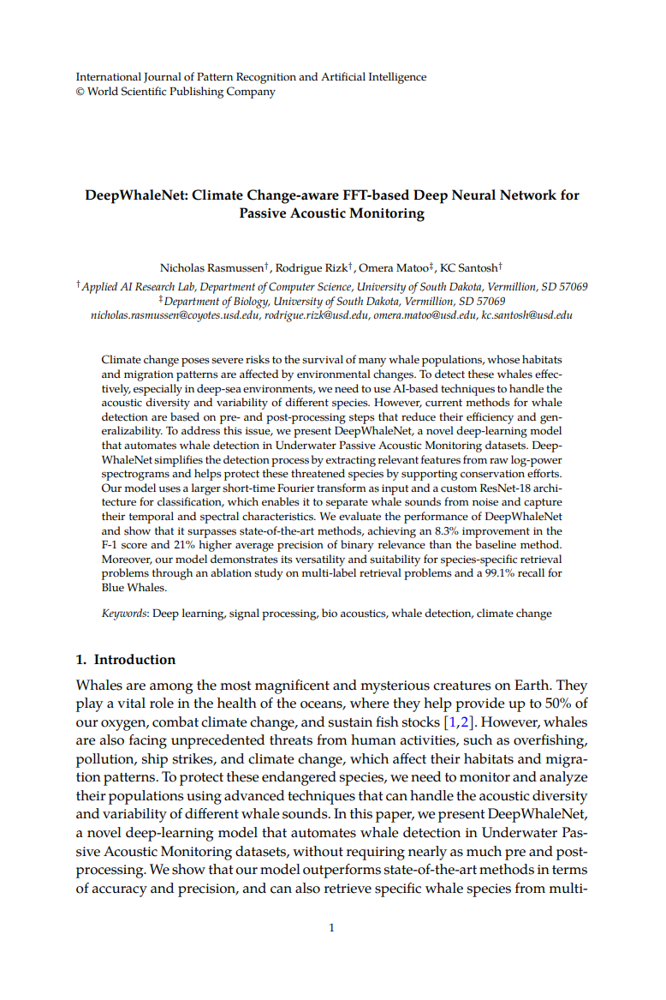

# DeepWhaleNet: An FFT-based Deep Neural Network for Passive Acoustic Monitoring
## Author: Nicholas Ryan Rasmussen - University of South Dakota - Computer Science Department - 2AI Lab

This code was designed for the IWC-SORP/SOOS Acoustic Trends Annotated Library downloaded as of 1-30-23

## Installation

Follow these steps to install and run the project:

1. **Download dataset from The IWC-SORP/SOOS Acoustic Trends Annotated Library**:

http://data.aad.gov.au/metadata/records/AcousticTrends_BlueFinLibrary

2. **Clone the repository**:

```bash
git clone https://github.com/Nickr234/antBlueFinThesis.git
```

3. **Navigate to the project directory**:

```bash
cd antBlueFinThesis
```

4. **Move Annotated Library into new Repository**:

```bash
cp -R /path/to/AcousticTrends_BlueFinLibrary/* /path/to/antBlueFinThesis/ ## Linux

xcopy /E /I C:\path\to\AcousticTrends_BlueFinLibrary\* C:\path\to\antBlueFinThesis\  ## Windows
```

5. **Set up a virtual environment** (optional but recommended):

```bash
python3 -m venv venv
source venv/bin/activate  # On Windows use `venv\Scripts\activate`
```

6. **Install the required packages**:

```bash
pip install -r requirements.txt
```

7. **Run the project**:

```bash
python runAll.py  # Replace with your main script
```

!Page One of IJPRAI Publication

./thesisFirstPage.png

 linked to [IJPRAI](./thesis_BlueFinWhaleP.pdf).